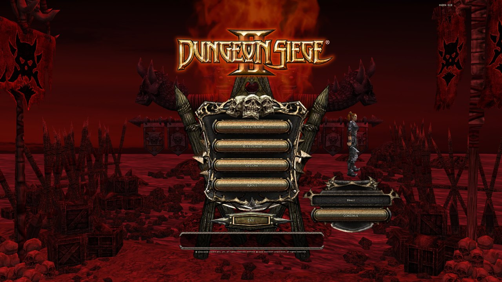
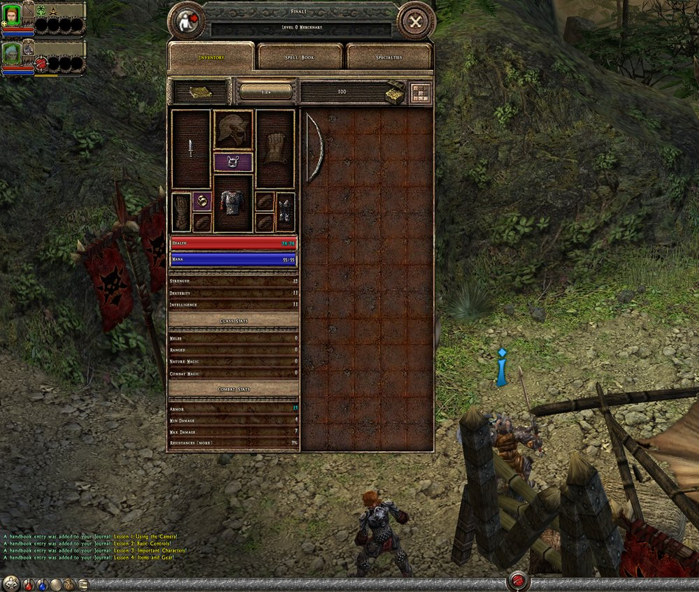
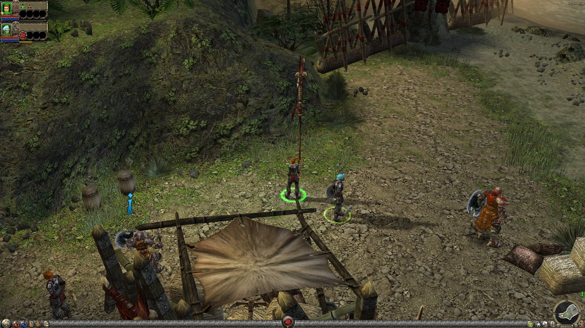

# DS2Fix

**Dungeon Siege II, modernized.** Widescreen HUD, native 16:9 menus scaled for your monitor, borderless
fullscreen that alt-tabs cleanly, every campaign difficulty unlocked from the start, saves that never
disappear, scaled in-game panels, a working party-leader portrait, and an uncapped framerate — for a
legally-owned GOG install of *Dungeon Siege II* v2.3, on **Windows** and **Linux** (Wine / Proton).

ds2fix does not distribute the game. It patches your install in place from a pristine backup, and
**Restore (uninstall)** puts the original files back. Saves are backed up before every patch and never touched.



## Download and run

Grab the latest build from the [Releases page](https://github.com/twhalley/ds2fix/releases). No Python needed.

| Platform | File | Run |
|---|---|---|
| Windows 10/11 | `ds2fix-gui_windows.exe` (GUI) · `ds2fix_windows.exe` (command line) | double-click the GUI, press **Patch + Play** |
| Linux | `ds2fix-gui_linux` (GUI) · `ds2fix_linux` (command line) | `chmod +x ds2fix-gui_linux && ./ds2fix-gui_linux` |

The install is auto-detected (GOG and Steam registry keys on Windows; Wine prefixes, Steam libraries and
Heroic on Linux). The GUI defaults to your monitor's resolution and a matching UI scale; change either, then
**Patch + Play**. To go back to the stock game, press **Restore (uninstall)**.

| | |
|---|---|
|  |  |

Status: **v1.0 (v0.1.10)** — everything in the table below is verified in-game on Windows 11 (native D3D9)
and on Linux/Wine (gamescope launcher). The Windows launcher runs the game as a borderless window at the
monitor's resolution (the gamescope role), so alt-tab is clean and there is no exclusive-mode switch.

## What works

| Feature | How |
|---|---|
| Widescreen HUD anchors correctly in gameplay | dynamic UI-canvas patch (exe) |
| Off-screen menus fixed | dynamic UI-canvas patch (exe) |
| Native 16:9 menu (not stretched) | `MENU_169` patches force the frontend to render 16:9 (exe) |
| Frontend menus scaled + centered for 16:9 | tank `.gas` rect transform (`tank_edit.py`) |
| In-game (ESC/pause) menu scaled + centered for 16:9 | tank `.gas` rect transform (`tank_edit.py`) |
| In-game "ds2fix 0.1.5" overlay, top-right during gameplay | tank `.gas` text node injected into `data_bar` HUD |
| All campaign difficulties (Merc/Vet/Elite) unlocked from the start | completion-check patch (exe) |
| Tank data mods no longer crash the game | content-integrity CRC check disabled (exe) |
| Non-resizable window (no resize black-screen) | window-style patch (exe) |
| In-game 3D viewports render at widescreen (Journal cloth map, character/inventory paperdoll, hero-creation preview) | force wined3d over DXVK — DXVK blanks these at high res |
| Saves always list + load, even after re-patching or installing a mod | save content-footprint check bypassed (exe) |
| Frontend preview models render in their panels (main-menu Continue party, hero-select paperdoll) | frontend `object_view` viewport scaled with its panel (tank) |
| Multiplayer button re-enabled (LAN + direct-IP) | `DisableButton` NOP (exe) |
| Windows 10/11: the DirectPlay legacy feature DS2 multiplayer needs is detected and can be enabled (stock DS2 crashes on Host/Join without it) | `ds2fix directplay --enable` / GUI button (elevated DISM) |
| Internet lobby points at OpenSpy instead of the dead GameSpy servers (`DS2FIX_OPENSPY=0` to keep stock) | every `gamespy.com` hostname → `openspy.net` (exe, same length) |
| A hosted multiplayer game defaults to the Mercenary world, not Elite (`DS2FIX_MPWORLD=0` to keep stock) | world list walked forwards at room creation (exe) |
| LAN/Internet joins work between ds2fix installs (stock refused them: "the game you are trying to join has been modified", because the UI edits change the content id per machine) | content-match refusal skipped (exe; `DS2FIX_MPCONTENT=0` to keep stock) |
| gamescope cleaned up when the game exits (no lingering compositor) | supervised launcher (`play-ds2.sh` / `ds2fix play`) |
| Large-Address-Aware (2GB→4GB) so HD-texture mods don't OOM-crash | PE-header bit (exe) |
| Party-leader HUD portrait renders at any resolution (stock DS2 shows it black above 1280 px wide) | portrait grab-rect patches (exe, both generators) |
| In-game panels (inventory / character / spell book / specialties) scaled with the menus, item grids included | tank panel transform + `UIGridbox::SetScale` exe patch |
| Uncapped framerate (DS2 hard-caps at 75) | `maxfps` launch arg (default 120; `--maxfps 0` = uncapped) |
| Optional mod installer (Storage Vault, HD Textures) — SHA512-verified, non-bundled | `ds2fix mods` + GUI |
| Configurable render + output resolution | `RES_W/RES_H`, `OUT_W/OUT_H` env |
| Configurable UI scale (menus + ESC menu) | `DS2_UISCALE` env (default 1.5) |
| Fullscreen, upscaled to monitor | Linux: `ds2fix.sh` / `play-ds2.sh` (gamescope + FSR); Windows: borderless window at monitor res (`WS_POPUP` exe patch + launcher placement) |
| Version label reads "ds2fix 0.1.5" | version-string patch (exe) |

## Quick start

**GUI** — double-click `ds2fix-gui_linux` (Linux) / `ds2fix-gui_windows.exe` (Windows): it auto-detects the install,
lets you pick a resolution (16:9 or 4:3 presets) / UI scale / 16:9-menu, then **Patch**, **Play**,
**Patch + Play**, or **Restore (uninstall)**.

**CLI** (`ds2fix_linux` / `ds2fix_windows.exe`, or `python ds2fix.py`):

```
ds2fix detect                   # find + report the install
ds2fix play                     # patch (16:9) + launch — Linux: 1920x1080 via gamescope; Windows: your monitor's res, borderless
ds2fix play --res 1440x1080     # 4:3 render (Linux: gamescope pillarboxes)
ds2fix play --out 3840x2160     # 4K output (Linux gamescope)
ds2fix play --no-menu169        # native 800x600 menu (restores the 3D model previews)
ds2fix play --maxfps 0          # uncap the framerate (DS2 defaults to 75; default here is 120)
ds2fix patch --scale 1.75       # patch only, bigger menus + ESC menu (default: auto = height/720, i.e. 1.5 @1080p, 2.0 @1440p)
ds2fix mods list                # optional mods: what's available + installed
ds2fix mods install hd-textures # install a downloaded, SHA512-verified mod into Resources/
ds2fix mods remove hd-textures  # cleanly uninstall it
ds2fix restore                  # revert exe+tank to pristine
ds2fix backup-saves             # back up your save games now
ds2fix restore-saves            # restore saves from the latest backup
ds2fix pin / unpin              # remember (or forget) this install across updates
ds2fix info                     # show patch / save / pin state
```

### Your saves are safe (and pinned)

DS2 stores saves **outside** the game folder — in `Documents/My Games/Dungeon Siege 2/Save/` (on Linux,
that's reached through a Wine symlink, and it belongs to a specific Wine **prefix**). ds2fix never touches
saves when patching. Two safeguards keep them that way:
- **Auto-backup:** every `patch`/`play` snapshots your `Save/` folder first (timestamped, kept under the
  ds2fix config dir — `~/.local/share/ds2fix/save-backups` / `%APPDATA%\ds2fix\save-backups`). Recover with
  `ds2fix restore-saves` (which also snapshots the current saves first, so it's never destructive).
- **Pinned install:** the first detected/`--gamedir` install is remembered, so **every update launches the
  same game + the same save folder** — you won't accidentally boot a different install (e.g. a Steam copy)
  with an empty save list. `ds2fix info` shows what's pinned; `ds2fix unpin` re-detects.

The install is **auto-detected** — **Windows:** the GOG & Steam registry keys, Steam library folders
(`libraryfolders.vdf`), and a scan of every drive letter's default folders; **Linux:** `$WINEPREFIX`,
Steam libraries, Heroic (GOG-on-Linux) install records, and a bounded scan of common Wine-prefix roots
(`~/.wine`, `/run/media`, `/mnt`, …). Override any time with `--gamedir <path>` or `DS2_GAMEDIR`.
Every `patch`/`play` **idempotently rebuilds from a pristine backup**
(captured on first run into `*.ds2fix-pristine`), so it's always reproducible and never patches an
already-patched file. On Linux it launches fullscreen via **gamescope + FSR**; on Windows as a **borderless
window** at the render resolution (defaults to the monitor's native res = borderless fullscreen; smaller
resolutions are centred), DPI-aware so display scaling doesn't blur it, with menus scaled to match.

### Optional mods (non-bundled)

ds2fix can install a couple of community mods, but it **does not distribute them** — you download the file
yourself (Nexus login required), and ds2fix locates it, **SHA512-verifies** it, copies the `.ds2res` into
`Resources/`, and tracks it for clean removal (`<gamedir>/.ds2fix-mods.json`). Supported:

- **Reset Skill Points** ([#17](https://www.nexusmods.com/dungeonsiegeii/mods/17)) — a hotbar button that
  refunds the selected character's skill points (respec). Its author also publishes the file on GitHub, so
  `ds2fix mods install reset-skills` fetches it for you (SHA512-verified) when no download is found.
- **Storage Vault** ([#26](https://www.nexusmods.com/dungeonsiegeii/mods/26)) — bigger stash + gold cap.
  The zip ships every vault size: pick one with `--pick <file.ds2res>`.
- **HD Textures** ([#29](https://www.nexusmods.com/dungeonsiegeii/mods/29)) — x4 AI-upscaled world art
  (the Large-Address-Aware patch is what keeps this from OOM-crashing). 4.5 GB; if the archive is not a
  zip, extract it and install with `--from <file.ds2res>`.

Download into `~/Downloads`, then `ds2fix mods install <name>` (auto-finds it) — or point at it with
`--from <file>`. Installing/removing a mod changes DS2's save "content footprint", which normally hides
existing saves from the load list — but the exe **save-footprint bypass** makes saves always list and load,
so mods are safe to add and remove with your saves intact. A mod that replaces a file ds2fix also edits
(Reset Skill Points replaces the HUD data bar) keeps working: ds2fix stores a pristine copy of each mod tank
under `<gamedir>/.ds2fix-mods/` and re-applies its own UI edits to it on every `patch`.

### Get the binaries

Standalone binaries (no Python needed) are built by CI — see [Releases](../../releases), or build locally:

```
pip install pyinstaller && python build.py     # -> dist/ds2fix_linux + ds2fix-gui_linux  (or *_windows.exe)
```

PyInstaller doesn't cross-compile, so build each OS on its own machine (the CI workflow in
`.github/workflows/build.yml` builds Linux + Windows on tag pushes). The Python source runs directly too:
`python ds2fix.py …` / `python ds2fix_gui.py`.

### Legacy Linux shell launcher (`ds2fix.sh`)

The original bash launcher still works on the dev machine (env-driven: `RES_W/RES_H`, `OUT_W/OUT_H`,
`DS2_UISCALE`, `MENU_169`, `DS2_PATCH_ONLY`) and mirrors the CLI. New work targets the cross-platform
`ds2fix` CLI/GUI above.

## The exe patcher (`patcher/patch_dynamic.py <pristine-exe> <out-exe>`)

All patches are on the pristine 32-bit `DungeonSiege2.exe`; keep a pristine backup as the patch base.
Env: `MENU_169` (0 disables the 16:9 menu), `RES_W`/`RES_H` (forced frontend res, default 1920×1080),
`CHOKE`/`WS169` (fine-grained MENU_169 sub-toggles).

- **Version label** — `$MSG$Version - %S` → `$MSG$ds2fix 0.1`.
- **Dynamic UI canvas** — `UIShell::SetScreenSize` (`FUN_0073be90`) trampolined through a new `.ds2fix`
  PE section so the canvas tracks the **live** window rect (`*(0xbcb28c)`) → HUD + menus anchor correctly.
- **Content-integrity CRC disable** — `FUN_00699df1` → `return 1` (+ secondary verifier). The key
  enabler: DS2 CRC-checks loaded `.gas` content (GameSpy-era anti-cheat); without this, any tank data
  mod crashes. Disabling it unlocks all data-side mods.
- **Auto-unlock difficulties** — `FUN_004171d7` (the `<world>_completed_<difficulty>` journal check,
  used by both SP `CanStartWorld` and MP join) forced to "always completed" → Veteran + Elite selectable
  from the start.
- **Non-resizable window** — drop `WS_THICKFRAME` (`0x10ce0000`→`0x10ca0000`); DS2 never rebuilds the
  swapchain on `WM_SIZE`, so dragging the border used to black it out.
- **MENU_169 (native 16:9 menu)** — force the frontend window/backbuffer to `RES_W×RES_H` (it otherwise
  hardcodes 800×600 through several paths): `CreateWindowExA` args, the config-read `jne`s, the
  WorldState/window-creation immediates, and the window-sizer choke point `FUN_005ebeba`.

## Tank tooling (DSg2Tank / .ds2res)

- **`patcher/tank_edit.py <tank> [scale]`** — general in-place `.gas` editor. Scales+centers the frontend
  **and in-game (ESC) menus** into the 16:9 canvas (each about its own content centre, so the 640×480 ESC
  menu lands centred like the 800×600 frontend), **and injects the top-right "ds2fix 0.1.5" overlay text node
  into the always-on `data_bar` HUD**. Recompresses within each file's slot, fixes size/CRC/chunk-table, and
  bumps the `.gas` FILETIME past its compiled `dir.lqd22` cache so the engine recompiles from source. To fit
  tight slots it strips trailing whitespace / blank lines (and dedents skrit-free files). Handles
  **multi-chunk** files correctly (each 16384-byte block = `zlib(first 16368B)` + 16 raw content bytes;
  table = `[total, blocksize] + per-chunk[uncomp, comp, rawtail, reloff]`, 4-byte aligned after the name).
  Requires the CRC check disabled (above).
- `patcher/tank_parse.py <tank>` — parse the DirSet/FileSet and reconstruct logical file paths.
- `patcher/carve.py <tank> <outdir>` — zlib-carve extraction of UI `.gas` text.

## Reverse-engineering (Ghidra, headless)

`ghidra/*.java` — headless scripts used to map the subsystems. `XChase.java` (xref+decompile via
`DS2_ADDRS`/`DS2_OUT`) and `Decomp.java` (decompile via `DS2_TARGETS`) are the workhorses. Run via
`analyzeHeadless <proj> ds2 -process DungeonSiege2.exe -noanalysis -scriptPath ghidra -postScript X.java`.

## Known issues
- **Multiplayer on Windows 10/11 needs the DirectPlay legacy feature.** It is off by default; the first Host/Join
  pops Windows' "needs the following Windows feature: DirectPlay" installer and, if that is skipped, stock DS2
  crashes. `ds2fix info` reports `directplay: NOT enabled`, `ds2fix play` prints a note, and
  `ds2fix directplay --enable` (or the GUI's **Enable DirectPlay (admin)…**) turns it on through DISM with a UAC
  prompt. Nothing else on the system is changed. Linux/Wine has its own DirectPlay.
- **Internet play needs the retail CD key.** DS2's "Internet" option is the GameSpy peer lobby; ds2fix redirects it
  to OpenSpy so it no longer dies on DNS, but the lobby then checks the CD key the retail/Steam installers put in
  the registry (`HKLM\Software\Microsoft\Microsoft Games\DungeonSiege2`, value `PID`). GOG installs have none,
  so they get "Could not find a valid CDKey". `ds2fix info` shows the state. LAN play needs no key. Hosts still
  forward the DirectPlay 8 ports (UDP 2300-2400 and 6073) for Internet games.
- **Two copies of DS2 on one PC cannot find each other's LAN games** (they share GameSpy's peer port 13139), so
  test LAN with two machines.
- **Joining checks no content any more.** DS2 refused to join a game whose content id differed ("has been
  modified... required content"); since ds2fix's own UI edits make every install's id unique, v0.1.15 skips that
  refusal. Two players with genuinely different gameplay mods can now join each other and may desync; keep
  mods identical on both sides (`DS2FIX_MPCONTENT=0` restores the stock check).
- **`object_view` 3D previews — RESOLVED.** The old symptom (blank preview panels / model stuck at the
  800×600 corner) turned out to be two separate causes, both now fixed: (1) **DXVK** blanked the viewport at
  high res — fixed by forcing **wined3d**; (2) the viewport **rect** was left at its native 800×600 position
  while the panel scaled to 1920, so the model drew in the wrong corner — fixed by scaling the frontend
  `object_view` rect with its panel (safe to recompile the frontend now that the save-footprint bypass keeps
  the party list visible). The main-menu Continue party model and the hero-select paperdoll now render on
  their pedestals. (In-game inventory/character paperdolls: same mechanism, enable + verify — see TODO.)
- gamescope on KDE Wayland intermittently fails to *present* ("Compositor released us but we were not
  acquired") — usually resolves on alt-tab / relaunch. (Separately, gamescope no longer *lingers* after
  the game exits — the launcher supervises the DS2 process and tears the gamescope tree + wineserver down
  on exit.)

## Roadmap (backlog)
- Co-op multiplayer revival (direct-IP/LAN over VPN; GameSpy master-server replacement) — GameSpy is dead

---
🤖 Tooling built with [Claude Code](https://claude.com/claude-code)
